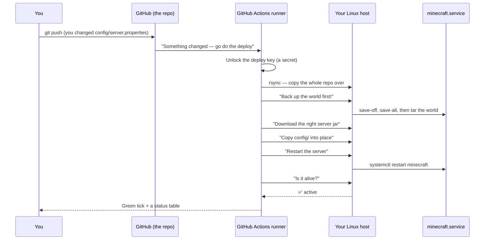
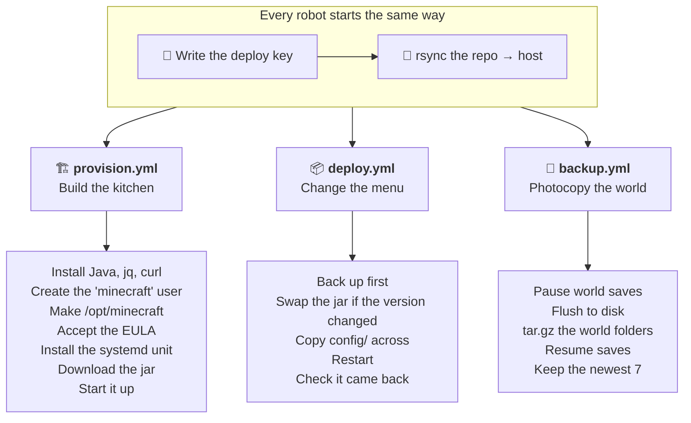
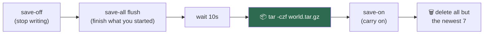
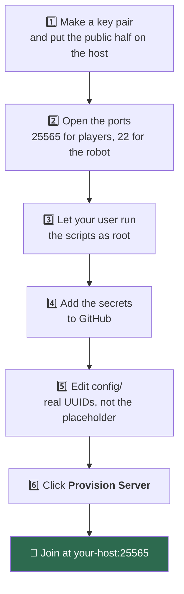
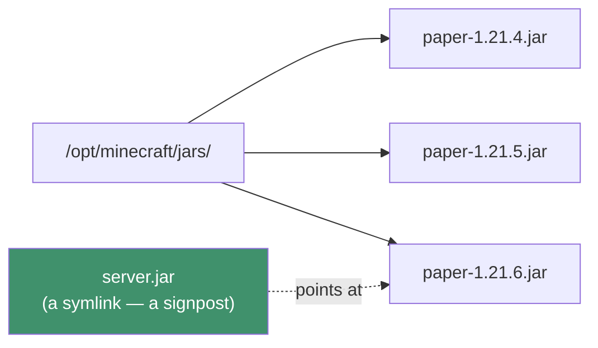
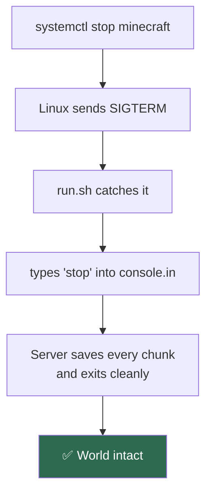
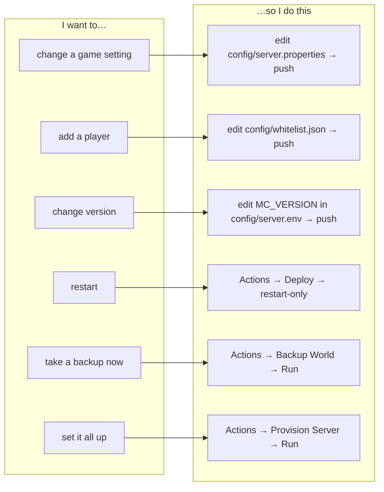

# Minecraft Server Setup

🎮 A Minecraft server that runs 24/7 on a computer in a data centre, and that you control **by editing text files on GitHub**.

You never have to log into the server, type Linux commands, or remember what you did last time. You change a file, you save it, and a robot goes and does all the work for you.

---

## Contents

- [The big idea (in plain words)](#the-big-idea-in-plain-words)
- [The cast of characters](#the-cast-of-characters)
- [How a change travels](#how-a-change-travels)
- [What's in this repository](#whats-in-this-repository)
- [The three robots (workflows)](#the-three-robots-workflows)
- [What you need before you start](#what-you-need-before-you-start)
- [Setup, step by step](#setup-step-by-step)
- [Day-to-day: the things you'll actually do](#day-to-day-the-things-youll-actually-do)
- [Under the hood](#under-the-hood)
- [When something breaks](#when-something-breaks)
- [Safety and security](#safety-and-security)

---

## The big idea (in plain words)

Imagine your Minecraft server is a **restaurant kitchen** in another city. You are the owner, but you're not there — you're at home.

The old way: you'd have to drive over every time you wanted to change the menu, unlock the door, walk in, and rewrite the menu board by hand. If you forgot what you changed last Tuesday, too bad.

The way this project works: you keep **the real menu in a notebook at home** (that's this repository — the `config/` folder). Whenever you cross something out and write something new in the notebook, a **delivery robot** picks up the notebook, drives to the kitchen, copies your menu onto the board, and restarts the kitchen so everyone sees the new menu.

The notebook is always right. If the kitchen board ever disagrees with the notebook, the notebook wins.

That's it. Three sentences:

> 1. The files in this repository describe exactly what your Minecraft server should be.
> 2. When you change a file and push it to GitHub, a free GitHub robot copies it to your server and applies it.
> 3. Because the notebook is in git, you can always see who changed what, and undo it.


---

## The cast of characters

There are only four things in this whole story. Get these and everything else is detail.

| Who | What they are | Think of them as |
|---|---|---|
| **This repository** | A folder of text files on GitHub | The notebook with the real menu in it |
| **GitHub Actions** | Free computers GitHub lends you for a few minutes at a time | The delivery robot |
| **Your host** | A Linux computer that stays on all the time (a cloud VM, a VPS, or an old PC in your cupboard) | The kitchen |
| **`minecraft.service`** | The Minecraft program running on the host, looked after by Linux | The chef who never sleeps |

Two important things about the delivery robot:

- **It is not always there.** GitHub gives you a fresh, empty computer, it does its job in a couple of minutes, and then it's thrown away. It has no memory of last time. Everything it needs to know is in this repository.
- **Nothing GitHub-ish is installed on your kitchen.** The host is a completely normal Linux box. The robot just connects to it over SSH (a secure remote-control connection), the same way you would from a terminal.

This matters because it means the host can be *anything*: Azure, AWS, Google Cloud, Hetzner, DigitalOcean, a Raspberry Pi under your desk. If you can SSH into it, this works.

---

## How a change travels

Here is the same story again, but with the real names of things. This is the diagram to come back to when you're confused.



Notice the order: **it backs up before it touches anything.** If a change turns out to be a terrible idea, yesterday-you still has a world to go back to.

---

## What's in this repository

```
Minecraft_Server_Setup/
│
├── config/                    👈 THE PART YOU EDIT
│   ├── server.env             which Minecraft, which version, how much memory
│   ├── server.properties      the normal Minecraft settings
│   ├── ops.json               who is an admin
│   ├── whitelist.json         who is allowed to join at all
│   └── banned-players.json    who is not welcome
│
├── scripts/                   the instructions the robot runs ON the host
│   ├── lib.sh                 shared helper code
│   ├── provision.sh           first-time setup: install everything
│   ├── update.sh              download / switch the server jar
│   ├── sync-config.sh         copy config/ onto the server
│   ├── backup.sh              safely zip up the world
│   ├── status.sh              print a little health report
│   └── runtime/
│       ├── minecraft.service  tells Linux how to keep the server running
│       └── run.sh             the command that actually starts Java
│
└── .github/
    ├── workflows/             the three robots
    │   ├── provision.yml
    │   ├── deploy.yml
    │   └── backup.yml
    └── actions/ssh-setup/     shared "connect to the host" step
```

**Rule of thumb:** if you're changing how the *game* behaves, it's in `config/`. If you're changing how the *machinery* behaves, it's in `scripts/`. Most people only ever touch `config/`.

### The files in `config/`, one by one

<table>
<tr><th>File</th><th>What it decides</th><th>Example of a change</th></tr>
<tr>
<td><code>server.env</code></td>
<td>Which flavour of server (vanilla or Paper), which Minecraft version, how much RAM Java may use, and which Java flags to run with</td>
<td><code>MC_VERSION=1.21.4</code> → <code>MC_VERSION=latest</code></td>
</tr>
<tr>
<td><code>server.properties</code></td>
<td>The classic Minecraft settings file: difficulty, gamemode, view distance, MOTD, PvP on/off…</td>
<td><code>difficulty=easy</code> → <code>difficulty=hard</code></td>
</tr>
<tr>
<td><code>ops.json</code></td>
<td>Operators — players who can use cheat-y admin commands</td>
<td>Add your own account so you can <code>/gamemode creative</code></td>
</tr>
<tr>
<td><code>whitelist.json</code></td>
<td>The guest list. If whitelisting is on, only these people can join</td>
<td>Add a friend's UUID so they can play</td>
</tr>
<tr>
<td><code>banned-players.json</code></td>
<td>The naughty list</td>
<td>Remove someone once they've said sorry</td>
</tr>
</table>

> ⚠️ `ops.json` and `whitelist.json` ship with a **fake placeholder UUID** (`00000000-0000-...`). The deploy will deliberately **refuse to run** until you replace it with real player IDs or an empty list `[]`. That's on purpose — pushing the placeholder would op nobody and whitelist nobody, and you'd spend an hour wondering why you can't join your own server.

---

## The three robots (workflows)

Each robot is a file in `.github/workflows/`. They all do the same first two steps — unlock the SSH key, copy the repo to the host — and then differ.



| Robot | When it runs | What it's for |
|---|---|---|
| **Provision Server** (`provision.yml`) | You click a button in the Actions tab | The very first setup. Safe to re-run any time — it never deletes a world. |
| **Deploy Config & Version** (`deploy.yml`) | Automatically on every push that touches `config/` or `scripts/`, or by button | The everyday one. 95% of your life is this robot. |
| **Backup World** (`backup.yml`) | Every day at 04:00 UTC, or by button | Insurance. |

All three share a **concurrency group** called `minecraft-vm`, which is a fancy way of saying: *only one robot may touch the server at a time, and the others politely queue.* Two robots restarting the server at once would be a mess.

### The clever bit in the backup

You can't just zip up a Minecraft world while the game is running — the server might be halfway through writing a chunk, and you'd get a corrupted copy. So `backup.sh` talks to the running server first:



And it uses a *trap* — a "no matter what happens, do this on the way out" instruction — so that even if the zipping fails catastrophically, `save-on` still runs. Leaving a live server with saving switched off would be genuinely bad.

---

## What you need before you start

| Requirement | Why it's needed |
|---|---|
| A Linux host reachable over SSH, with **key-based login** | The GitHub robot has to be able to get in |
| **Debian or Ubuntu** | `provision.sh` installs packages with `apt-get` |
| **systemd** | It's what keeps the server running and restarts it if it crashes |
| **`sudo`** for your SSH user | Installing Java and managing the service need admin rights |
| **`rsync`** installed on the host | That's how the repo gets copied over (`apt-get install rsync`) |
| **4 GB RAM minimum** | 8 GB if you want Paper + plugins + a dozen friends |
| **TCP port 25565 open** | That's the door players knock on |

Using Fedora, Arch, or Alpine instead? Swap the `apt-get` block in `scripts/provision.sh` for your package manager. Everything else in this project is distro-agnostic.

---

## Setup, step by step

Do these once. Then you're done forever.



### 1. Create a deploy key

A key pair is like a padlock and its key. You give the **padlock** (the `.pub` file) to the host, and you give the **key** (the file with no extension) to GitHub as a secret. Anyone holding the key can open that padlock, so the key never, ever goes into git.

```bash
ssh-keygen -t ed25519 -f ~/.ssh/mc_deploy -C github-actions
ssh-copy-id -i ~/.ssh/mc_deploy.pub <user>@<host>
```

### 2. Open the ports

Two doors need to be open, and you usually have to open each one **twice** — once in your cloud provider's firewall, and once in the host's own firewall (`ufw`, if it's running).

| Port | Who knocks on it |
|---|---|
| **25565** | Minecraft players |
| **22** | The GitHub robot |

<details>
<summary>📘 Azure example (click to expand)</summary>

```bash
az group create -n minecraft-rg -l eastus
az vm create -g minecraft-rg -n minecraft-vm \
  --image Ubuntu2404 --size Standard_B2ms \
  --admin-username azureuser --ssh-key-values ~/.ssh/mc_deploy.pub \
  --public-ip-sku Standard --storage-sku Premium_LRS
az vm open-port -g minecraft-rg -n minecraft-vm --port 25565 --priority 1001

# A dynamic public IP changes on deallocate; pin it and get a DNS name.
az network public-ip update -g minecraft-rg -n minecraft-vmPublicIP \
  --allocation-method Static --dns-name my-minecraft
```
</details>

> 🏠 **Give the host a static IP or a DNS name.** A dynamic IP is like a house that changes address every time everyone goes out. One reboot and both the robot *and* your friends' saved server entry are knocking on a stranger's door.

### 3. Let the deploy user run the scripts as root

Installing Java and restarting a service need admin powers. Rather than handing over blanket admin rights, you list exactly which commands are allowed:

```bash
sudo tee /etc/sudoers.d/minecraft-deploy >/dev/null <<'EOF'
<user> ALL=(ALL) NOPASSWD: /home/<user>/minecraft-deploy/scripts/provision.sh, \
                           /home/<user>/minecraft-deploy/scripts/update.sh, \
                           /home/<user>/minecraft-deploy/scripts/sync-config.sh, \
                           /home/<user>/minecraft-deploy/scripts/backup.sh, \
                           /home/<user>/minecraft-deploy/scripts/status.sh, \
                           /usr/bin/systemctl restart minecraft, \
                           /usr/bin/cp, /usr/bin/chown
EOF
sudo chmod 440 /etc/sudoers.d/minecraft-deploy
```

Replace `<user>` with your actual SSH username. Then read [Safety and security](#safety-and-security), because this step has a catch worth understanding.

### 4. Add the secrets to GitHub

*Settings → Secrets and variables → Actions.* A **secret** is a value GitHub stores in a vault and hands to the robot at the last second, hiding it from the logs.

| Secret | What goes in it |
|---|---|
| `SSH_HOST` | The IP address or DNS name of your host |
| `SSH_USER` | The SSH username (`azureuser`, `ubuntu`, `root`…) |
| `SSH_PRIVATE_KEY` | The whole contents of `~/.ssh/mc_deploy` |
| `SSH_KNOWN_HOSTS` | Output of `ssh-keyscan -H <host>` — optional, but recommended |

Also optional: a repository **variable** `SSH_PORT`, if your SSH isn't on port 22.

> 💡 The workflows reference a GitHub **environment** called `minecraft`. Put the secrets there if you want an approval gate before every deploy; plain repository secrets work fine otherwise.
>
> 🔐 `SSH_KNOWN_HOSTS` is the host's fingerprint. With it, the robot can tell "yes, this really is my server" instead of trusting whoever answers the phone. Without it, the robot trusts the first host key it sees and prints a warning.

### 5. Edit `config/`

At minimum, replace the placeholder UUIDs. To find a player's UUID:

```
https://api.mojang.com/users/profiles/minecraft/<their-username>
```

Or set the lists to `[]` if you don't want a whitelist or any ops yet.

### 6. Run **Provision Server**

Actions tab → *Provision Server* → *Run workflow*. Watch the log. At the end you get a little status table telling you whether the server is alive, which version it's running, and how big the world is.

Then open Minecraft, add a server, and type your host's address. 🎉

---

## Day-to-day: the things you'll actually do

### Change a setting or add a player

1. Edit the file in `config/` (you can do this right in GitHub's web editor).
2. Commit to `main`.
3. Walk away. The deploy robot backs up, applies the change, restarts, and verifies.

### Upgrade the Minecraft version

Change `MC_VERSION` in `config/server.env` and push:

```diff
- MC_VERSION=1.21.4
+ MC_VERSION=1.21.5
```

Set it to `latest` to always track the newest release.

**Rolling back is easy on purpose.** The old jar isn't deleted — it stays in `/opt/minecraft/jars/`. So going back is just reverting one line of a text file and pushing.



`server.jar` is a **symlink**: not a copy of the file, just a signpost saying "the real one is over there." Switching versions just moves the signpost.

### Restart without changing anything

Actions → *Deploy Config & Version* → *Run workflow* → choose `restart-only`.

The other choices:

| Choice | Does |
|---|---|
| `sync-and-update` *(default)* | Backup, update jar, sync config, restart |
| `sync-config-only` | Backup, sync config, restart — leave the jar alone |
| `update-jar-only` | Backup, update jar, restart — leave config alone |
| `restart-only` | Just restart (no backup — nothing is changing) |

### Restore a backup

On the host:

```bash
sudo systemctl stop minecraft
sudo -u minecraft tar -xzf /opt/minecraft/backups/world-<stamp>.tar.gz -C /opt/minecraft
sudo systemctl start minecraft
```

### Type commands into the server console

The running server reads its commands from a special file called a **FIFO** — a pipe you can pour text into, and it comes out the other end as if you'd typed it at the keyboard.

```bash
echo "say hello everyone" | sudo -u minecraft tee /opt/minecraft/console.in
sudo journalctl -u minecraft -f     # watch the log live
```

---

## Under the hood

You don't need this section to use the project. It's here for when you get curious.

### Where everything lives on the host

```
/opt/minecraft/                 ← the server's home
├── server.jar        →  jars/paper-1.21.4.jar   (symlink)
├── jars/                       every version ever downloaded
├── backups/                    the newest 7 world archives
├── bin/run.sh                  what actually launches Java
├── server.env                  the host's copy of your settings
├── console.in                  the FIFO you type commands into
├── eula.txt                    "yes, I accept the Minecraft EULA"
├── server.properties           ← copied from config/
├── ops.json  whitelist.json  banned-players.json   ← copied from config/
└── world/  world_nether/  world_the_end/          the actual world

/etc/systemd/system/minecraft.service    the "keep this running" instruction
/home/<user>/minecraft-deploy/           where the robot rsyncs this repo
```

### Why there's a `run.sh` and not just a `java` command

Two problems, both solved by that little script:

**Problem 1 — the server keeps hanging up.** Minecraft reads commands from its standard input. If you point that at a normal file, the server reads to the end, sees "no more input", decides the operator has left, and shuts itself down. So `run.sh` starts a `sleep infinity` process that holds the pipe open forever. The pipe never ends, so the server never thinks you've gone.

**Problem 2 — pulling the plug mid-save.** When you run `systemctl stop`, Linux sends a polite "please finish up" signal (`SIGTERM`). Java doesn't know what to do with that, so it would just die — possibly mid-write. `run.sh` catches the signal and instead types `stop` into the console, which is the proper in-game shutdown that saves everything first. The unit file allows a generous 180 seconds for that to happen.



### How it finds the right jar to download

`resolve_jar_url` in `scripts/lib.sh` asks the official source, so you never paste a download link:

- **vanilla** → Mojang's version manifest → the metadata for your version → the server download URL.
- **paper** → PaperMC's API → the newest **stable** build for your version. Pre-releases and release candidates (anything with a `-` in the name) are deliberately skipped, so `latest` never accidentally puts your friends on a beta.

### Why `provision.sh` is safe to run twice

It's **idempotent** — a long word meaning "running it again changes nothing new." It checks before it acts: does the user exist already? Is the jar already downloaded? Is the folder already there? Nothing in it deletes a world. If a provision half-fails, just run it again.

### How settings can be overridden for one run

`load_env` reads `config/server.env` but **only sets a value if it isn't already set**. That means a workflow input can win over the committed file. So you can click *Provision Server* and type `memory: 8G` to try something once, without committing it. Next normal deploy, the file's value comes back.

### The security hardening in the systemd unit

The `minecraft.service` file locks the server into a small box:

| Setting | Meaning |
|---|---|
| `User=minecraft` | Runs as a dedicated user with no login shell — not as root |
| `NoNewPrivileges=true` | It can never gain more power than it started with |
| `ProtectHome=true` | It cannot see anybody's home folder |
| `ProtectSystem=full` | Most of the filesystem is read-only to it |
| `ReadWritePaths=/opt/minecraft` | …except its own folder, which is the only place it may write |
| `PrivateTmp=true` | It gets its own private `/tmp` |
| `Restart=on-failure` | If it crashes, Linux starts it again after 15 seconds |

---

## When something breaks

| Symptom | Likely cause | Fix |
|---|---|---|
| Deploy fails with *"still contains the placeholder UUID"* | You didn't replace the fake UUIDs | Put real UUIDs in `ops.json` / `whitelist.json`, or use `[]` |
| Robot can't connect at all | Wrong `SSH_HOST`, wrong key, or port 22 closed | Try `ssh -i ~/.ssh/mc_deploy <user>@<host>` yourself |
| *"sudo: a password is required"* | The sudoers file from step 3 is missing or has the wrong username/path | Recheck `/etc/sudoers.d/minecraft-deploy` |
| Server starts, then dies seconds later | `MC_MEMORY` is bigger than the machine's actual RAM | Lower it; leave ~2 GB for the OS |
| Friends can't join, but the workflow is green | Port 25565 open in only one of the two firewalls | Check the cloud firewall *and* `ufw` |
| Wrong Java version errors | Newer Minecraft needs newer Java | Bump `MC_JAVA_VERSION` and re-run *Provision Server* |
| Nightly backups quietly stopped | GitHub pauses scheduled workflows on repos with 60 days of no activity | Push anything, or run the workflow by hand |

**Your first two debugging moves, always:**

```bash
sudo systemctl status minecraft      # is it alive?
sudo journalctl -u minecraft -n 100  # what did it say on the way down?
```

---

## Safety and security

Three things worth knowing plainly:

**1. Port 22 is open to the entire internet.** It has to be — GitHub's runners don't have fixed IP addresses, so there's nothing you can allow-list. Defend it properly: keep `PasswordAuthentication no` in `/etc/ssh/sshd_config` so only keys work, and consider installing `fail2ban` to block repeat guessers.

**2. Push access to `main` is effectively root on the host.** The sudoers rule in step 3 only allows specific scripts — but those scripts come *from this repository*. Anyone who can change a script and push it can make the host run it as root. So:

- Keep the repository **private**.
- **Protect `main`** with branch protection.
- **Never** let these workflows run on pull requests from forks.

**3. The backup keeps 7 archives, on the same machine as the world.** That protects you from "I made a bad change." It does **not** protect you from "the machine died." For anything you'd be sad to lose, push the archive off the host to object storage. Downloading backups as GitHub artifacts is opt-in for a reason — worlds outgrow the artifact size limits fast.

---

## Quick reference card



Happy mining. ⛏️
